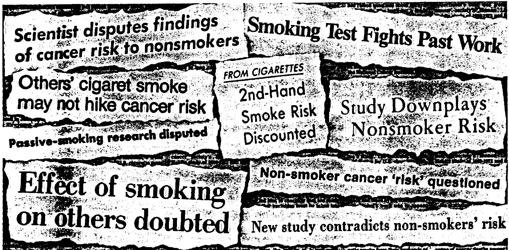

# HERE'S WHAT'S NOW BEING SAID ABOUT OTHER PEOPLE'S CIGARETTE SMOKE.

Several months ago, headlines around the world trumpeted alarming news. A Japanese study was claiming that non-smoking wives of smokers had a higher risk of lung cancer because of their husbands' tobacco smoke. That scared a lot of people and understandably so, if this claim was the last word.

But now new headlines have appeared. First because several apparent errors are reported to have been found in the Japanese study—raising

serious questions about it.

Second, because Lawrence Garfinkel, the statistical director of the American Cancer Society who is opposed to smoking, published a report covering 17 years and nearly 200,000 people in which he indicated that "second-hand" smoke has insignificant effect on lung cancer rates in nonsmokers.

For more information on this important public issue, write Scientific Division, The Tobacco Institute, 1875 I St., N.W., Washington, D.C. 20006.

BEFORE YOU BELIEVE HALF THE STORY GET THE WHOLE STORY.